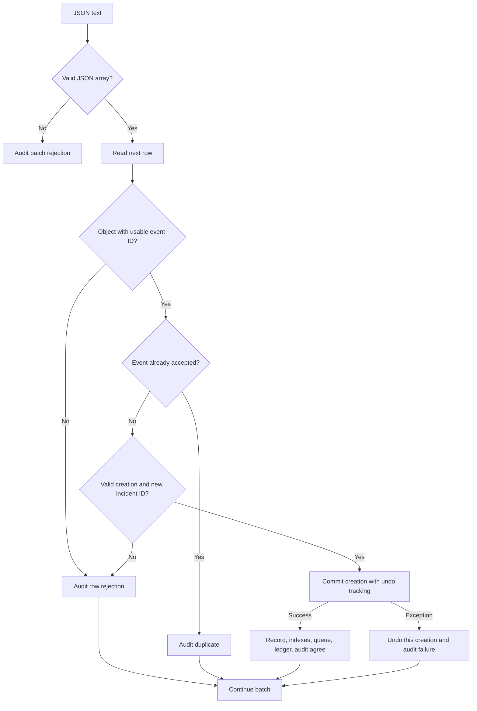
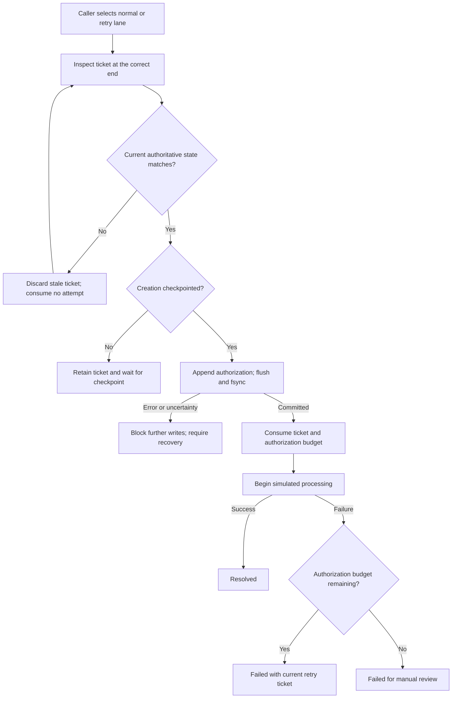

# Northstar: authority, scheduling, and durable permission

## Intake and creation

JSON parsing establishes Python objects, not trustworthy business data. Batch shape and individual row validity are separate contracts. A structurally valid array can contain an invalid row without preventing later rows from being examined.

The successful-event ledger contains accepted IDs. An invalid request cannot reserve an event ID and prevent a corrected request from succeeding. Once an ID is accepted, later occurrences are ignored before checking their remaining creation fields. Deduplication is by event identity, not equality of the whole JSON payload.

| Input | Agreed rule |
| --- | --- |
| Batch | JSON text, array root; empty array allowed |
| Row | Object |
| `event_id`, `incident_id`, `shipment_id` | Nonempty case-sensitive strings; surrounding whitespace rejected |
| `type`, `region` | Required nonblank strings; trim outer whitespace, preserve case |
| `priority` | Exact integer 1–5; `true`/`false` invalid |
| `tags` | List, possibly empty; each tag a nonblank string; trim, lowercase, deduplicate |
| Extra fields | Ignored |
| Existing incident ID with a new event ID | Reject creation; preserve existing information |

`create_incident` registers a small undo entry before each mutation. Undo only touches the new record, new memberships, and entries appended by this operation. It preserves existing shared shipment/tag memberships. The allocator may retain a gap after failure; scheduling does not require consecutive numbers.

For `t` tags and bounded field lengths, creation and rollback take expected `O(1 + t)` work. They do not copy all incidents or scan the existing queue. Failure audit records remain after accepted-state changes are undone. This concerns recoverable application exceptions; arbitrary memory exhaustion during rollback or audit itself is not a transaction guarantee.

## Sources of truth

| Structure | Representation | Authority and purpose |
| --- | --- | --- |
| `incidents_by_id` | `dict[incident_id, record]` | Authoritative incident fields, status, attempt budget, and scheduling metadata |
| `successful_event_ids` | `set[event_id]` | Authoritative successful-event ledger |
| `shipment_index` | `dict[shipment_id, set[incident_id]]` | Derived lookup index |
| `tag_index` | `dict[normalized_tag, set[incident_id]]` | Derived lookup index |
| `normal_queue` | `deque[(incident_id, sequence)]` | Derived FIFO candidates |
| `retry_stack` | `list[(incident_id, failed_attempt, sequence)]` | Derived LIFO candidates, top at the list's end |
| `audit_trail` | `list[entry]` | Important actions, decisions, failures, UTC timestamps, and known IDs |
| `next_sequence` | Increasing integer | Allocator for new scheduling positions |
| Authorization watermark | Increasing integer | Fully incorporated journal prefix in a checkpoint |

`next_sequence` cannot recover a missing ticket's old position. The incident independently stores `queue_sequence` and its current `retry_sequence`. Restore can rebuild missing or stale tickets from those authoritative fields. An exhausted incident has no current retry sequence. Queue sequence remains as creation history even after work finishes.

The runtime set `checkpointed_creation_ids` is populated only by a successful checkpoint or a validated restore. It is internal evidence, not a caller-supplied `saved=True` flag.

Lookup costs are expected `O(1)` to find a hash bucket, then `O(r)` to copy `r` matches. Retrieving a copied complete record additionally costs its record size. These are average hash-table costs, not adversarial worst-case bounds. Indexes retain terminal incidents too: tag/shipment queries find all associated incidents.

## Scheduling and processing

A ticket is a candidate, not permission. Status, sequence, current failed attempt, remaining budget, and creation persistence are rechecked before durable authorization. Stale tickets can remain after cancellation; they cannot override authority.

Popping one deque end or stack end is `O(1)`. Selecting a candidate costs `O(s + 1)` if `s` stale entries must first be removed. Each stale entry is discarded once, so their cleanup is amortized over the entries encountered. Stale skipping may occasionally produce a longer individual call; it is not an unconditional constant-time selection guarantee.

| From | To | Trigger and rule |
| --- | --- | --- |
| `queued` | `processing` | Durable authorization; total budget must be below 3 |
| `queued` | `cancelled` | Operator cancellation |
| `processing` | `resolved` | Simulated successful outcome |
| `processing` | `failed` | Simulated failure or interrupted authorization recovery |
| `failed` | `processing` | Matching current retry and durable authorization; budget below 3 |
| `failed` | `cancelled` | Operator cancellation |
| `failed` | `resolved` | Manual resolution with a nonblank reason |
| `resolved`, `cancelled` | Any other state | Rejected |

Attempts count **durable authorizations**, not confirmed worker starts. Work may begin only after authorization commits. A crash between those two moments still consumes the slot. This conservative rule prevents a fourth real attempt when outcome evidence is missing.

## Checkpoint and journal protocol

The checkpoint contains version, store identity, checkpoint ID, authorization watermark, allocator, complete incidents, successful event IDs, ordered tickets, and audit history. Sets become JSON arrays. Derived lookup indexes are rebuilt. A store identity detects accidentally pairing different stores' checkpoint/journal files.

Saving is serialized with all other operations:

1. Capture the fully applied authorization prefix and creation IDs being saved.
2. Serialize into a same-directory temporary file.
3. Flush/fsync and close that complete file.
4. Atomically replace `state.json`.
5. Publish the checkpoint's watermark and creation coverage in memory.
6. Replace the now-covered authorization journal with an empty file.

If the temporary write fails, the previous checkpoint remains. If confirmation after replacement is interrupted, stop using that live state and recover. If only journal cleanup fails, the new checkpoint remains committed and covered journal entries may remain safely.

Every authorization contains `store_id`, increasing `authorization_id`, `incident_id`, the incident's new `attempt` number, and a UTC timestamp. It is one bounded JSONL line. Append, flush, fsync, then allow work. The file deliberately has no misleading JSON field that claims a write committed merely because its text says so.

Recovery builds a separate candidate state:

1. Parse and validate the entire checkpoint's shape and authoritative semantics.
2. Rebuild indexes and schedules from incident metadata.
3. Read the journal's complete prefix; validate identity, schema, IDs, and attempts.
4. Skip covered records at or below the watermark. Apply uncovered records in consecutive authorization order, requiring exactly the next per-incident attempt.
5. Convert interrupted `processing` records to `failed`, preserving consumed counts.
6. Reconcile scheduling. Use saved relative order where known; require an explicit operator decision where it is ambiguous.
7. Validate recovered authoritative state before publishing it. Only then may a known incomplete final journal append be trimmed.

Replay assigns the recorded attempt after validating the predecessor. It never blindly adds the number again. A checkpoint watermark prevents a covered successful resolution from turning into a failure on the next restart. The total persisted authorization count must equal the incorporated prefix; no incident deletion is supported.

An authorization remains represented in the journal, in the committed checkpoint, or temporarily in both. Cleanup must never remove the only surviving evidence.

The full checkpoint has `O(N + E + A + T + Q + R)` serialized data work, accounting for incident records, successful events, audit, tag memberships/field data, and tickets; actual bytes matter when field sizes vary. Restore also sorts scheduling metadata, adding `O(Q log Q + R log R)` worst-case work. Journal replay is linear in retained journal bytes/records. Individual authorization writes are independent of total incident count, although fsync latency depends on storage.

## Reporting

Unresolved means `queued`, `processing`, or `failed`, including exhausted failures. `top_unresolved(state, k)` filters authoritative records into a temporary list, sorts by `(-priority, incident_id)`, and returns at most `k` IDs. `k` is a nonnegative exact integer; `k=0` returns an empty list. Incident IDs use case-sensitive string ordering.

For `N` incidents and `U` unresolved records, this is `O(N + U log U)` time and `O(U)` temporary references. The report never sorts or mutates the operational deque or retry stack. More advanced selection structures are a possible future optimization if repeated report queries become a measured bottleneck.

